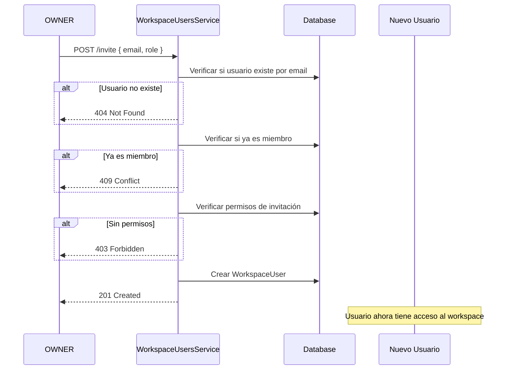
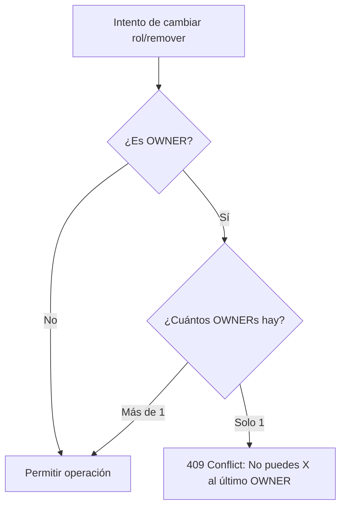

# Workspace Users Module

## Descripción

El módulo de **Workspace Users** gestiona la membresía de usuarios dentro de un workspace, incluyendo invitaciones, roles, permisos y eliminación de miembros.

## Características

- ✅ Sistema de invitaciones por email
- ✅ Jerarquía de roles (OWNER > DOCTOR > RECEPTIONIST)
- ✅ Control granular de permisos
- ✅ Protección del último OWNER
- ✅ Auto-remoción permitida
- ✅ Validación de unicidad (no duplicar invitaciones)

## Modelo de Datos

```prisma
model WorkspaceUser {
  id          String   @id @default(cuid())
  workspaceId String
  userId      String
  role        WorkspaceRole
  createdAt   DateTime @default(now())

  workspace   Workspace @relation(fields: [workspaceId], references: [id], onDelete: Cascade)
  user        User      @relation(fields: [userId], references: [id], onDelete: Cascade)

  @@unique([workspaceId, userId])
}

enum WorkspaceRole {
  OWNER
  DOCTOR
  RECEPTIONIST
}
```

## Jerarquía de Roles

```
OWNER (nivel 3)
  ├─ Gestión completa del workspace
  ├─ Invitar/remover cualquier rol
  ├─ Cambiar roles de cualquier usuario
  └─ Eliminar workspace

DOCTOR (nivel 2)
  ├─ Invitar DOCTOR o RECEPTIONIST
  ├─ Remover RECEPTIONIST
  ├─ Gestión de campañas y pacientes
  └─ Ver analytics

RECEPTIONIST (nivel 1)
  ├─ Ver campañas
  ├─ Upload pacientes
  └─ Sin permisos de gestión de usuarios
```

## Endpoints

### 1. Listar usuarios del workspace

```http
GET /api/workspaces/:workspaceId/users
```

**Headers:**
```
Authorization: Bearer {token}
```

**Parámetros:**
- `workspaceId`: ID del workspace

**Respuesta:**
```json
[
  {
    "id": "wu-1",
    "role": "OWNER",
    "joinedAt": "2025-11-15T10:00:00Z",
    "user": {
      "id": "user-123",
      "name": "Dr. Juan Pérez",
      "email": "perez@example.com",
      "image": "https://..."
    }
  },
  {
    "id": "wu-2",
    "role": "DOCTOR",
    "joinedAt": "2025-11-20T14:30:00Z",
    "user": {
      "id": "user-456",
      "name": "Dra. María García",
      "email": "garcia@example.com",
      "image": null
    }
  }
]
```

**Descripción:** Retorna todos los miembros del workspace ordenados por fecha de ingreso (ascendente).

**Permisos:** Cualquier miembro del workspace

---

### 2. Invitar usuario

```http
POST /api/workspaces/:workspaceId/users/invite
```

**Headers:**
```
Authorization: Bearer {token}
Content-Type: application/json
```

**Parámetros:**
- `workspaceId`: ID del workspace

**Body:**
```json
{
  "email": "nuevo@example.com",
  "role": "DOCTOR"
}
```

**Validaciones:**
- `email`: Requerido, email válido
- `role`: Requerido, enum (`OWNER`, `DOCTOR`, `RECEPTIONIST`)

**Respuesta:**
```json
{
  "id": "wu-3",
  "workspaceId": "clx123...",
  "userId": "user-789",
  "role": "DOCTOR",
  "createdAt": "2025-11-27T15:30:00Z"
}
```

**Permisos por rol:**

| Rol Invitante | Puede invitar |
|---------------|---------------|
| OWNER | OWNER, DOCTOR, RECEPTIONIST |
| DOCTOR | DOCTOR, RECEPTIONIST |
| RECEPTIONIST | ❌ Ninguno |

**Errores:**
- `404 Not Found`: "Usuario no encontrado"
- `403 Forbidden`: "No tienes permiso para invitar este rol"
- `409 Conflict`: "Usuario ya es miembro del workspace"

---

### 3. Cambiar rol de usuario

```http
PUT /api/workspaces/:workspaceId/users/:userId/role
```

**Headers:**
```
Authorization: Bearer {token}
Content-Type: application/json
```

**Parámetros:**
- `workspaceId`: ID del workspace
- `userId`: ID del usuario a modificar

**Body:**
```json
{
  "role": "RECEPTIONIST"
}
```

**Validaciones:**
- `role`: Requerido, enum (`OWNER`, `DOCTOR`, `RECEPTIONIST`)

**Respuesta:**
```json
{
  "id": "wu-2",
  "workspaceId": "clx123...",
  "userId": "user-456",
  "role": "RECEPTIONIST",
  "createdAt": "2025-11-20T14:30:00Z"
}
```

**Permisos:** Solo OWNER

**Reglas de negocio:**
- ❌ No se puede cambiar el rol del último OWNER
- ❌ Debe haber al menos 1 OWNER en el workspace

**Errores:**
- `403 Forbidden`: "Solo los OWNER pueden cambiar roles"
- `404 Not Found`: Usuario no encontrado en workspace
- `409 Conflict`: "No puedes cambiar el rol del último OWNER"

---

### 4. Remover usuario

```http
DELETE /api/workspaces/:workspaceId/users/:userId
```

**Headers:**
```
Authorization: Bearer {token}
```

**Parámetros:**
- `workspaceId`: ID del workspace
- `userId`: ID del usuario a remover

**Respuesta:**
```
204 No Content
```

**Permisos por rol:**

| Rol Ejecutor | Puede remover |
|--------------|---------------|
| OWNER | Cualquier usuario (excepto último OWNER) |
| DOCTOR | RECEPTIONIST |
| RECEPTIONIST | ❌ Ninguno |
| Cualquiera | ✅ A sí mismo (auto-remoción) |

**Reglas de negocio:**
- ✅ Cualquier usuario puede removerse a sí mismo
- ❌ No se puede remover al último OWNER
- ❌ DOCTOR no puede remover a OWNER o DOCTOR
- ❌ RECEPTIONIST no puede remover a nadie (solo auto-remoción)

**Errores:**
- `403 Forbidden`: "No tienes permiso para remover este usuario"
- `404 Not Found`: Usuario no encontrado en workspace
- `409 Conflict`: "No puedes remover al último OWNER del workspace"

---

## Matriz de Permisos

### Invitar Usuarios

|  | Invitar OWNER | Invitar DOCTOR | Invitar RECEPTIONIST |
|--|---------------|----------------|---------------------|
| **OWNER** | ✅ | ✅ | ✅ |
| **DOCTOR** | ❌ | ✅ | ✅ |
| **RECEPTIONIST** | ❌ | ❌ | ❌ |

### Cambiar Roles

|  | Cambiar roles |
|--|---------------|
| **OWNER** | ✅ (excepto último OWNER) |
| **DOCTOR** | ❌ |
| **RECEPTIONIST** | ❌ |

### Remover Usuarios

|  | Remover OWNER | Remover DOCTOR | Remover RECEPTIONIST | Auto-remoción |
|--|---------------|----------------|---------------------|---------------|
| **OWNER** | ✅* | ✅ | ✅ | ✅ |
| **DOCTOR** | ❌ | ❌ | ✅ | ✅ |
| **RECEPTIONIST** | ❌ | ❌ | ❌ | ✅ |

\* Excepto el último OWNER

## Flujos de Trabajo

### Flujo de Invitación



### Flujo de Protección de Último OWNER



## Ejemplos de Uso

### Invitar un doctor

```bash
curl -X POST http://localhost:3000/api/workspaces/clx123.../users/invite \
  -H "Authorization: Bearer eyJhbGc..." \
  -H "Content-Type: application/json" \
  -d '{
    "email": "doctor@example.com",
    "role": "DOCTOR"
  }'
```

### Degradar DOCTOR a RECEPTIONIST (solo OWNER)

```bash
curl -X PUT http://localhost:3000/api/workspaces/clx123.../users/user-456/role \
  -H "Authorization: Bearer eyJhbGc..." \
  -H "Content-Type: application/json" \
  -d '{
    "role": "RECEPTIONIST"
  }'
```

### DOCTOR remueve a RECEPTIONIST

```bash
curl -X DELETE http://localhost:3000/api/workspaces/clx123.../users/user-789 \
  -H "Authorization: Bearer eyJhbGc..."

# Respuesta: 204 No Content
```

### RECEPTIONIST intenta remover a DOCTOR (fallará)

```bash
curl -X DELETE http://localhost:3000/api/workspaces/clx123.../users/user-456 \
  -H "Authorization: Bearer eyJhbGc..."

# Respuesta: 403 Forbidden
# {
#   "statusCode": 403,
#   "message": "No tienes permiso para remover este usuario"
# }
```

### Auto-remoción (cualquier rol)

```bash
# Usuario se remueve a sí mismo
curl -X DELETE http://localhost:3000/api/workspaces/clx123.../users/mi-user-id \
  -H "Authorization: Bearer eyJhbGc..."

# Respuesta: 204 No Content
```

### Intentar remover último OWNER (fallará)

```bash
curl -X DELETE http://localhost:3000/api/workspaces/clx123.../users/ultimo-owner-id \
  -H "Authorization: Bearer eyJhbGc..."

# Respuesta: 409 Conflict
# {
#   "statusCode": 409,
#   "message": "No puedes remover al último OWNER del workspace"
# }
```

## Testing

Ejecutar tests unitarios:

```bash
pnpm nx test api --testFile=workspace-users.service.spec.ts
```

**Cobertura:** 15/15 tests pasando (100%)

### Tests Implementados

1. ✅ Listar usuarios con información completa
2. ✅ OWNER invita cualquier rol
3. ✅ DOCTOR invita DOCTOR/RECEPTIONIST
4. ✅ DOCTOR no puede invitar OWNER
5. ✅ No invitar usuario inexistente
6. ✅ No duplicar invitaciones
7. ✅ OWNER cambia cualquier rol
8. ✅ No-OWNER no puede cambiar roles
9. ✅ No cambiar rol del último OWNER
10. ✅ OWNER remueve cualquier usuario
11. ✅ DOCTOR remueve RECEPTIONIST
12. ✅ Auto-remoción permitida
13. ✅ No remover último OWNER
14. ✅ DOCTOR no remueve OWNER
15. ✅ RECEPTIONIST no remueve a nadie

## Arquitectura

```
WorkspaceUsersController
    ↓
WorkspaceUsersService
    ├─ canInviteRole() - Validación de permisos de invitación
    ├─ canRemoveUser() - Validación de permisos de remoción
    └─ isLastOwner() - Protección de último OWNER
    ↓
PrismaService
    ↓
PostgreSQL (workspaceUser table)
```

## Guards Aplicados

- `BetterAuthGuard`: Verifica autenticación
- `WorkspaceGuard`: Valida membresía en workspace
- `RoleGuard`: Valida permisos según endpoint

## Limitaciones por Plan

| Plan | Máximo de Usuarios |
|------|-------------------|
| FREE | 1 |
| STARTER | 2 |
| PROFESSIONAL | 5 |
| ENTERPRISE | Ilimitado |

> **Nota:** Las validaciones de límites por plan se implementarán en el módulo de Billing.

## Notificaciones (Futuro)

Cuando se implemente el módulo de notificaciones:

- ✉️ Email al invitar usuario: "Has sido invitado a {workspace}"
- ✉️ Email al cambiar rol: "Tu rol cambió a {newRole}"
- ✉️ Email al ser removido: "Has sido removido de {workspace}"

## Mejoras Futuras

- [ ] Validar límites de usuarios por plan
- [ ] Sistema de invitaciones pendientes (link de aceptación)
- [ ] Historial de cambios de roles (audit log)
- [ ] Transferencia de ownership (cambiar OWNER)
- [ ] Permisos granulares personalizados
- [ ] Invitación masiva por CSV
- [ ] Expiración de invitaciones (24-48 horas)
